# 📚 BES Üniversitesi - Bilgi Yönetim Sistemi

> **Not:** Bu proje hayali bir üniversite olan *BES Üniversitesi* için geliştirilmiştir. Gerçek bir kurum değildir.

---

## 📌 Proje Açıklaması

Bu proje, Bilgisayar Mühendisliği Web Programlama dersi kapsamında **Program Çıktılarını (PÇ)** gözlemlemek amacıyla hazırlanmıştır.

Bu sistem sayesinde kullanıcılar;

- 🎓 Öğrenci yönetimi
- 📚 Ders yönetimi
- 👨‍🏫 Öğretim elemanı yönetimi
- 📈 Program çıktısı gözlemleme

gibi işlemleri web arayüzü üzerinden gerçekleştirebilir.

---

## 🔐 Giriş Bilgileri

Aşağıdaki bilgilerle sisteme giriş yapabilirsiniz:

- **ID:** `1`  
- **Şifre:** `1234`

---

## ⚙️ Kullanılan Teknolojiler

### Frontend
- HTML  
- CSS  
- JavaScript  
- Bootstrap 5

### Backend
- Python Flask

### Veritabanı
- SQLAlchemy

---

## 👥 Katkıda Bulunanlar

- Elif Sena Harman  
- Şerife Şevval Mert  
- İrem Buse Özköse  

---

## 📝 NOT

- Proje **sanal ortam** (virtual environment - `venv`) kullanılarak geliştirilip test edilmiştir.

---

## 📷 Screenshots

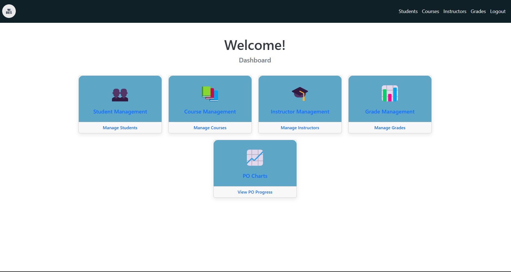

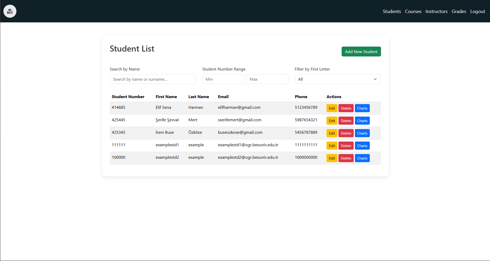

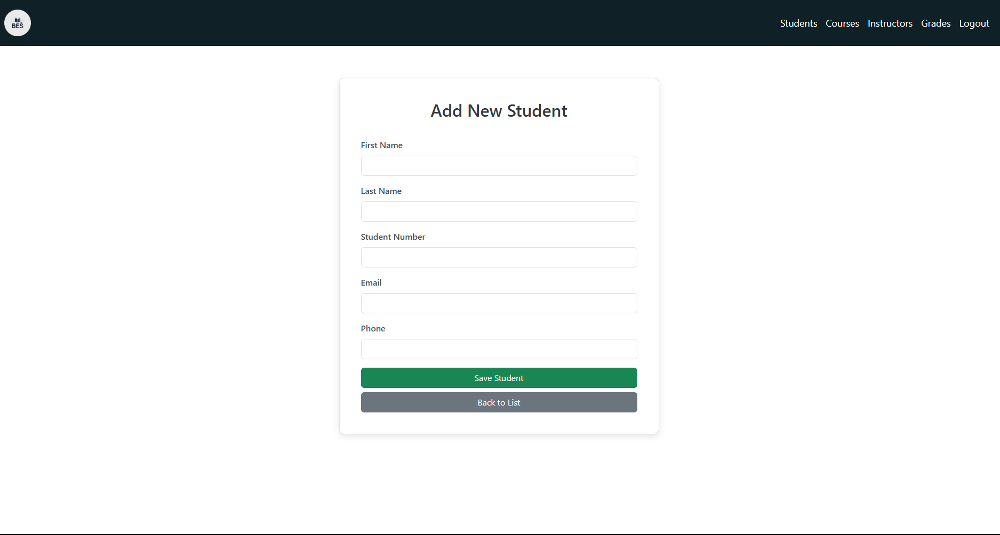

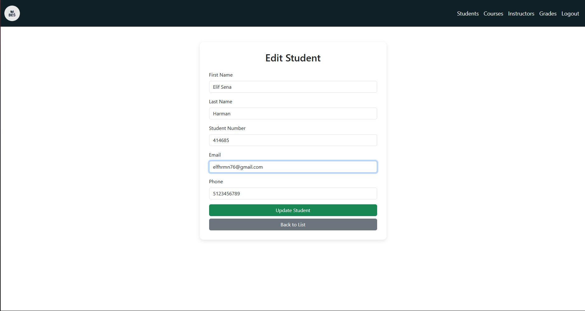

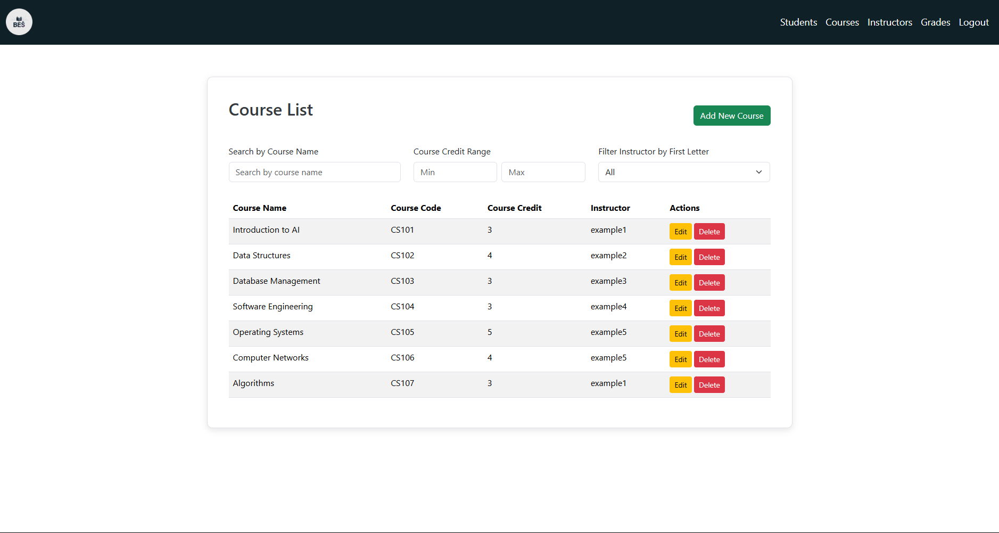

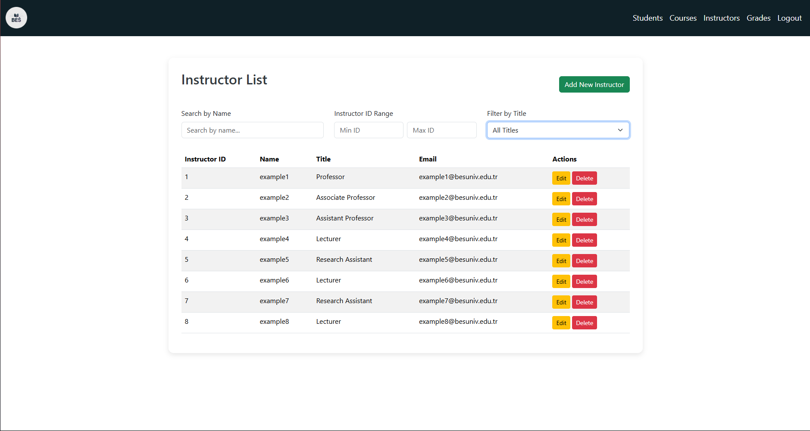

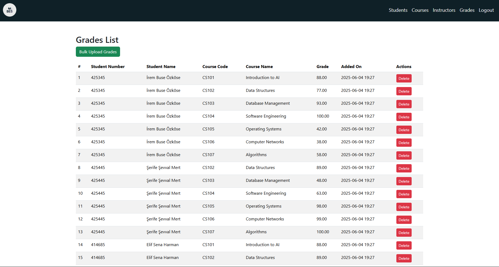

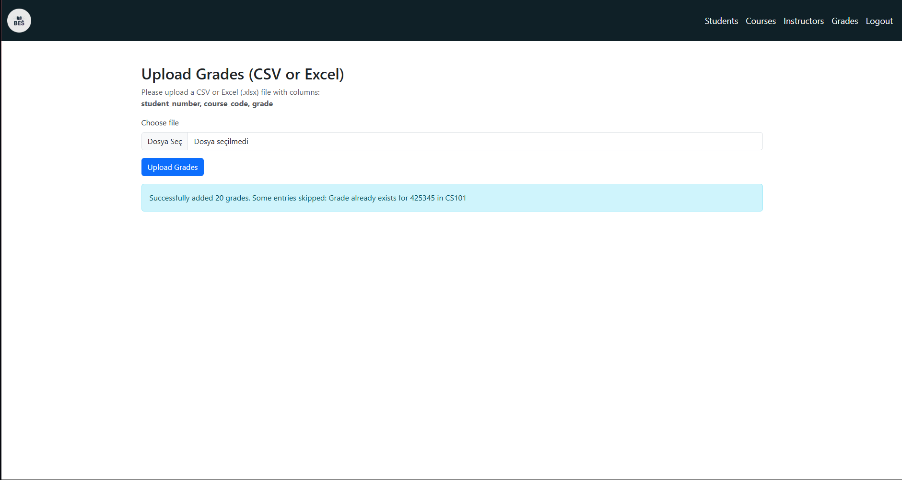

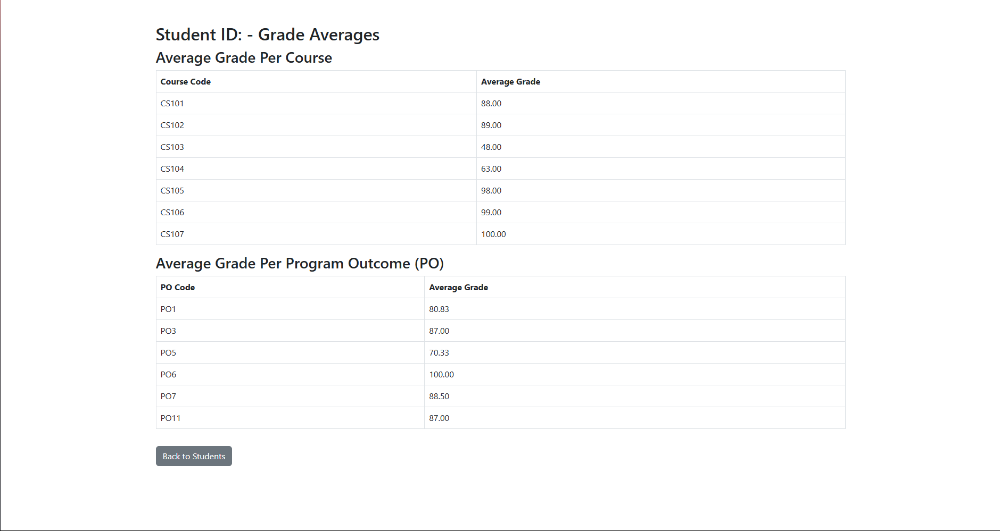

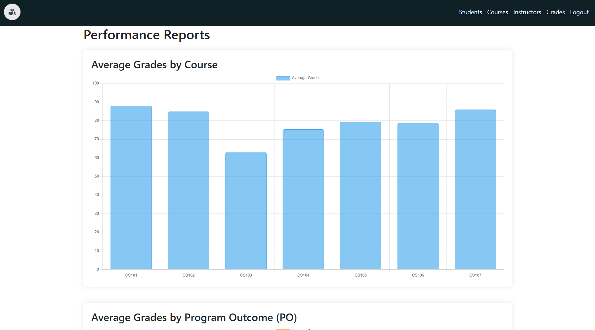

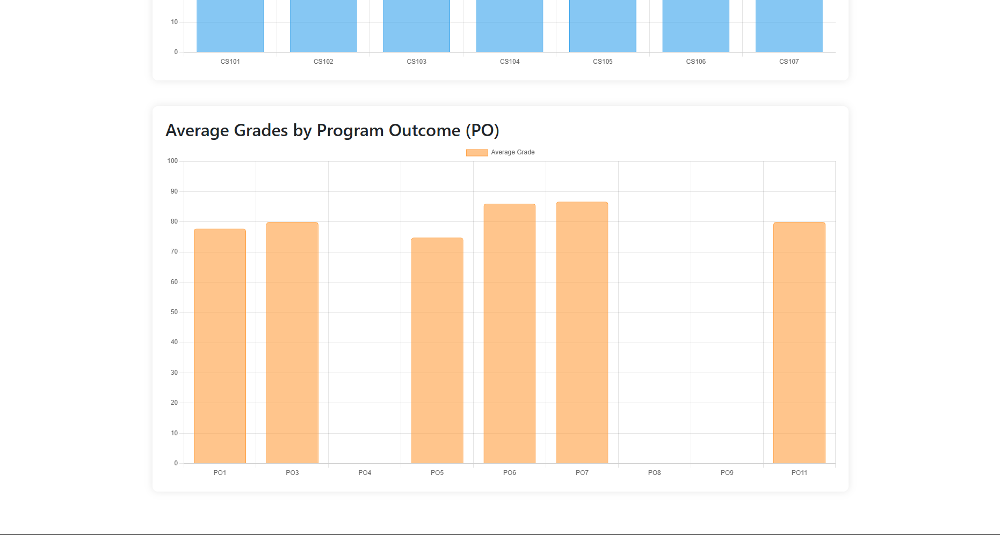
